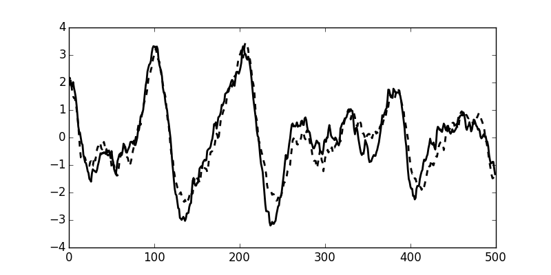
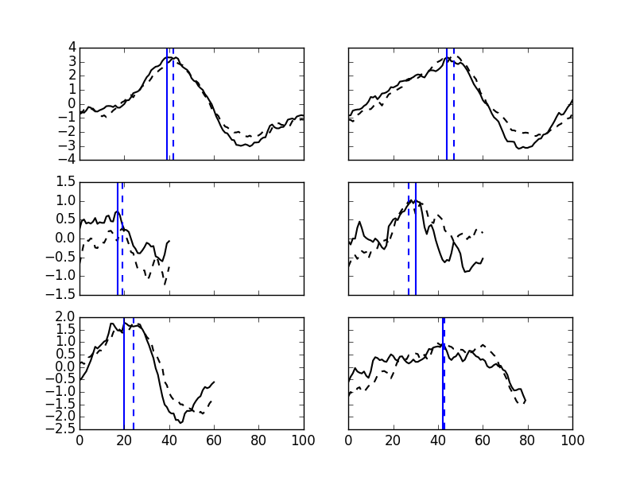

## Relationship between Southern Ocean and Global Carbon Content
### May 12, 2016 

At first glance, the Southern Ocean and Global carbon content timeseries seem to be identical. I originally assumed that the Southern Ocean was causing changes in the global carbon content, but looking closer, it appears that the global changes in carbon lead the Southern Ocean changes in carbon by approximately 3 years in this simualtion. 

Full Timeseries of Global (solid) and Southern Ocean (dashed) carbon content: 

Broke up each 'event' into individual periods and calculated the maximum carbon content. In general, the Global signal leads by ~3 years.
