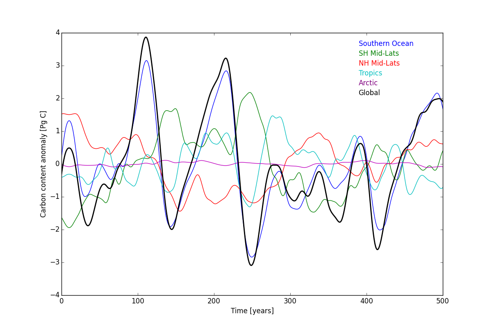
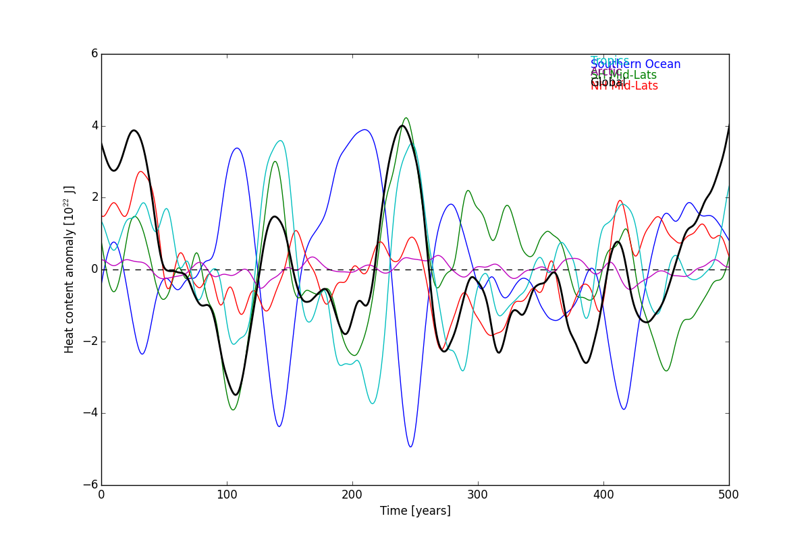

### What causes ocean carbon and heat content variabiliry in ESM2Mc? 

Starting with Aredi800 simulation: Broke up the global ocean into 6 different regions (figure 1): Southern Ocean, South Pacific, South Atlantic, North Pacific, North Atlantic, and Arctic. The only region which shows the same magnitude of variability is the Southern Ocean (figure 2).

 Carbon Content| Heat Content 
:----------:|:----------------:
|
