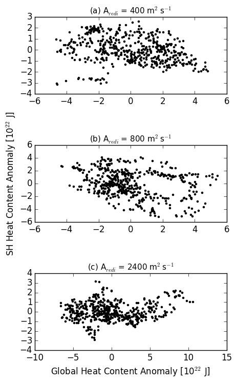

### March 18, 2016
Plotted the ocean carbon content and ocean heat content for the different aredi simulations (scripts: *plot_aredi_global_occ.py* and *plot_aredi_global_phc.py*). For the Aredi = 400 and 2400 cases, there is significant drift in the ocean heat content and carbon content during the timeseries. The low mixing simulation drifts towards a state of higher heat content (not shown), and the higher mixing simulation drifts towards a state of lower heat content (not shown). For carbon content, the control simulations (aredi=800), also had a drift (increasing carbon content). This same increasing carbon content drift is seen in the high and low mixing simulations (not shown). 

Ocean Carbon Content      |  Ocean Heat Content 
:-------------------------:|:-------------------------:
  |  
Global ocean (solid line) and Southern Ocean (dashed line) carbon content for various aredi simulations. | Global ocean (solid line) and Southern Ocean (dashed line) heat content for various aredi simulations.  .

To better visualize the relationship between the global and Southern Ocean heat/carbon content the scatter plot of these variables is shown below. The relationship for the Aredi = 800 carbon content is very strong. Less of an obvious relationship for the other mixing cases.   
Ocean Carbon Content      |  Ocean Heat Content  
:-------------------------:|:-------------------------:  
  |  
