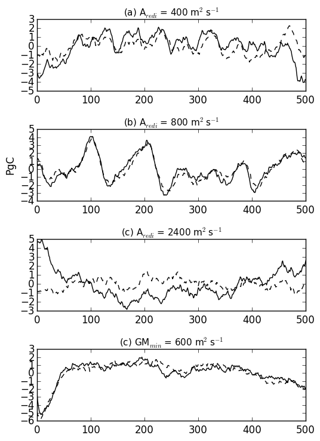

### March 13, 2016
Plotted the ocean carbon content and ocean heat content for the different aredi simulations (scripts: *plot_aredi_global_occ.py* and *plot_aredi_global_phc.py*). For the Aredi = 400 and 2400 cases, there is significant drift in the ocean heat content and carbon content during the timeseries. The low mixing simulation drifts towards a state of higher heat content (not shown), and the higher mixing simulation drifts towards a state of lower heat content (not shown). For carbon content, the control simulations (aredi=800), also had a drift (increasing carbon content). This same increasing carbon content drift is seen in the high and low mixing simulations (not shown). 

Ocean Carbon Content                |  Ocean Heat Content 
:-------------------------:|:-------------------------:
  |  