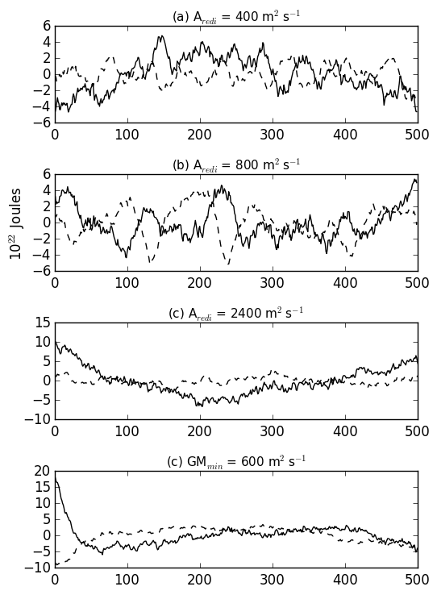

## OHC and OCC Detrending Methods 
### May 11, 2016 

Detrending process for ocean heat and carbon content. Originally tried detrending with a linear fit, but resulted in inaccuricies at beginning and end of timeseries. Ended up detrending with a quadratic fit. 

Heat and Carbon content using a linear trend removal:
Carbon Content| Heat Content 
:----------:|:----------------:
|

Heat and Carbon content using a quadratic trend removal: 
Carbon Content| Heat Content 
:----------:|:----------------:
|
