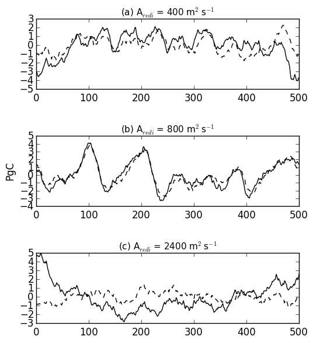
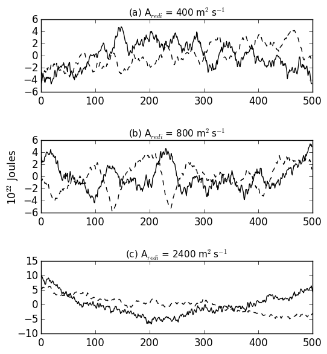

# Paper Outline
## Introduction

### Motivation:
Ocean carbon and heat uptake and storage are very important processes in regulating the s climate. As shown in Frolicher et al. (2015) there is considerable uncertainty in carbon and heat uptake and storage as represented by CMIP5 models, especially in the Southern Ocean. A further complicating factor is open ocean deep convection in the Weddell Sea. Often referred to as the Weddell polynya, these deep convective events are important for the formation of Antarctic Bottom water and the global heat and carbon budget (Killworth, 1983). Climate models simulate deep convection oscillations to varying degrees and frequencies (de Lavergne et al., 2014); however, with few observational constraints it is difficult to determine how well modeling groups represent Southern Ocean dynamics.

### Literature:

### Aim:

Quantify the effect Weddell Sea convection has on local and global ocean carbon and heat storage.

## Methods

### Aredi Simulations:  
We use the GFDL ESM2Mc, a coarse resolution configuration of the GFDL ESM2Mc. We use different parameterizations for the lateral mixing coefficient, Aredi (Redi, 1982), and mesoscale eddy advenction, Gent-McWilliams (Gent & McWilliams, 1990), to asses the impact on the heat and carbon content. Here we analyze 4 pre-industrial control simulations:
* Three simulations where Aredi is constant at 400, 800, and 2400 m$^2$  
* GM minimum value is increased from 200 to 600 m2s-1 (Aredi = 800 m$^2$s$^{-1}$)

These model simulations span a range of convective variability, ranging from no convection in the GMmin = 600 simulation, to constantly convecting in the Aredi = 2400 simulation. These different convective states of the model will allow us to identify the impact convective variability has on both carbon and heat in the Southern Ocean and globally.   

Annually-averaged Weddell Sea subsurface temperature for different mixing simulations. Black line indicates average MLD. Low-mixing simulation (Aredi = 400 m2s-1) show periodic deep convection events in the Weddell Sea with periods of no convection where subsurface heat build up. High mixing simulation (Aredi = 2400 m2s-1) shows constant convection with no subsurface heat build up.

Temperature Climatology               |  Salinity Climatology
:-------------------------:|:-------------------------:
 | 

DIC Climatology               |  Age Climatology
:-------------------------:|:-------------------------:
 | 

## Results

### Current Results:

Ocean Carbon Content      |  Ocean Heat Content
:-------------------------:|:-------------------------:
  |  
Global ocean (solid line) and Southern Ocean (dashed line) carbon content for various aredi simulations. | Global ocean (solid line) and Southern Ocean (dashed line) heat content for various aredi simulations.  .

Global carbon content and Southern Ocean (50-70S) carbon content are very closely correlated and have similar magnitude. This indicates that the global carbon content variability is driven by the Southern Ocean. This relationship is strongest when Aredi=800, and less robust when Aredi=2400. Global ocean heat content on the other hand is anti-correlated with Southern Ocean heat content.  

## To Do List:
1. Complete GMmin simulation (currently on year 375)
2. Quantify variability in heat and carbon content
2. Quantify convection and convective variability.  
   - Convection criterion (MLD is pretty subjective. Maybe MLD+sub surface temperature?)
   - Quantify the timescales of convection.
3. Start with 800 simulation, create figures for multiple (3) convective events and 3 non-convective periods to make sure consistent picture. Think about composite.
4. Surface Impacts
   - Quanitfy surface heat flux for each simulation.
   - Quantify changes due to cloud albedo.
   - Changes in SH westerly wind strength/location.
   - Sea Ice changes
5. Ocean Interior Changes
   - Water mass formation rates/ages.
   - How does the ocean circulation change?
