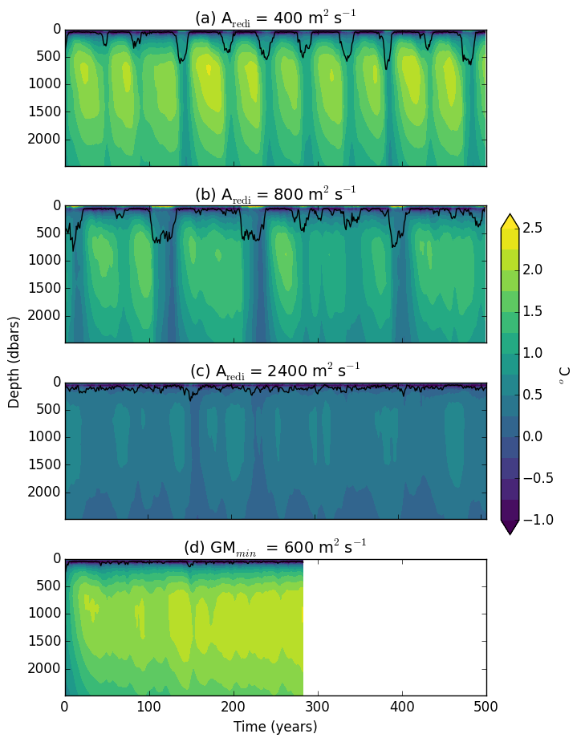

# Paper Outline 

### Motivation: 
Ocean carbon and heat uptake and storage are very important processes in regulating the s climate. As shown in Frolicher et al. (2015) there is considerable uncertainty in carbon and heat uptake and storage as represented by CMIP5 models, especially in the Southern Ocean. A further complicating factor is open ocean deep convection in the Weddell Sea. Often referred to as the Weddell polynya, these deep convective events are important for the formation of Antarctic Bottom water and the global heat and carbon budget (Killworth, 1983). Climate models simulate deep convection oscillations to varying degrees and frequencies (de Lavergne et al., 2014); however, with few observational constraints it is difficult to determine how well modeling groups represent Southern Ocean dynamics.

### Previous Papers using Aredi Simulation Suite: 
***Gnanadesikan et al, 2015: Isopycnal mixing by mesoscale eddies significantly impacts oceanic anthropogenic carbon uptake.***  

Key Points:   
Carbon uptake varies significantly across historical model simulations that use different constant values of the lateral mixing coefficient, Aredi. The highest carbon uptake occurs in a simulation that uses a high mixing coefficient (2400m^2s^-1), while the lowest carbon uptake occurs in the simulation that uses a low coefficient (400 m^2s^-1). Under instantaneous doubling CO2 simulations, there is a 21% range in carbon uptake across the aredi simulations.

***Pradal & Gnanadesikan, 2014: How does the Redi parameter for mesoscale mixing impact global climate in an Earth System Model?***  

Key Points:   
Changing the Aredi parameterization in the GFDL ESM2Mc model has a significant impact on sea surface temperature (SST). When the lateral mixing coefficient is increased to 2400 m^2s^-1, the global SST increases by about 1C relative to a low mixing coefficient (400 m^2s^-1), but stronger warming occurs regionally. Increasing the along-isopycnal mixing coefficient results in an increase in pole-ward salt transport through neutral diffusion in the top few hundred meters of the water column. This increase in pole-ward transport of salt results in the polar surface waters getting saltier, therefore decreasing the strength of the polar halocline and allowing more warm waters to reach the surface from the sub-surface. These warm waters melt the sea ice, and results in more shortwave radiation absorbtion by the ocean, thus warming the polar oceans by a significant amount. 

***Gnanadesikan et al., 2015: Exploring the isopycnal mixing and helium-heat paradoxes in a suite of Earth System Models***

***Gnanadesikan et al., in prep: Changes in the isopycnal mixing coefficient produce significant, but compensated, changes in ocean carbon pumps.***

### Aim:

## Methods: 
### Aredi Simulations:  
We use the GFDL ESM2Mc, a coarse resolution configuration of the GFDL ESM2Mc. We use different parameterizations for the lateral mixing coefficient, Aredi (Redi, 1982), and mesoscale eddy advenction, Gent-McWilliams (Gent & McWilliams, 1990), to asses the impact on the heat and carbon content. Here we analyze 4 pre-industrial control simulations: 
* Three simulations where Aredi is constant at 400, 800, and 2400 m2  
* GM minimum value is increased from 200 to 600 m2s-1 (Aredi = 800 m2s-1)

## Current Results: 
***Simply changing the along-isopycnal mixing parameterization significantly changes the convective variability in the GCM. Additionally, by changing the GM miximum value, convection ceases in the Weddell Sea.*** 

Annually-averaged Weddell Sea subsurface temperature for different mixing simulations. Black line indicates average MLD. Low-mixing simulation (Aredi = 400 m2s-1) show periodic deep convection events in the Weddell Sea with periods of no convection where subsurface heat build up. High mixing simulation (Aredi = 2400 m2s-1) shows constant convection with no subsurface heat build up.

&nbsp;

&nbsp;

&nbsp;

&nbsp;

&nbsp; 

&nbsp; 

&nbsp; 

&nbsp;

&nbsp;

***While raising the GM minimum value stops Weddell Sea convection, there is not a change in the average ocean circulation over the period of the model run. Therefore changing the parameterization changes convection, but not the overall dynamics.*** 

Temperature Climatology               |  Salinity Climatology
:-------------------------:|:-------------------------:
 | 

DIC Climatology               |  Age Climatology
:-------------------------:|:-------------------------:
 | 

&nbsp; 

## To Do List: 
